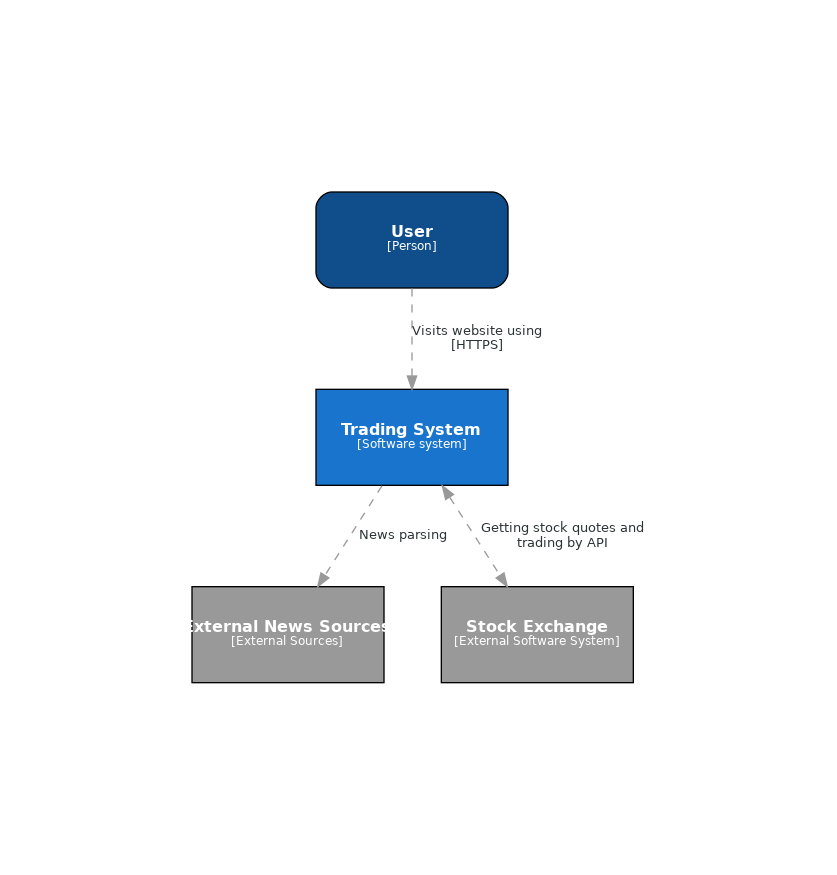
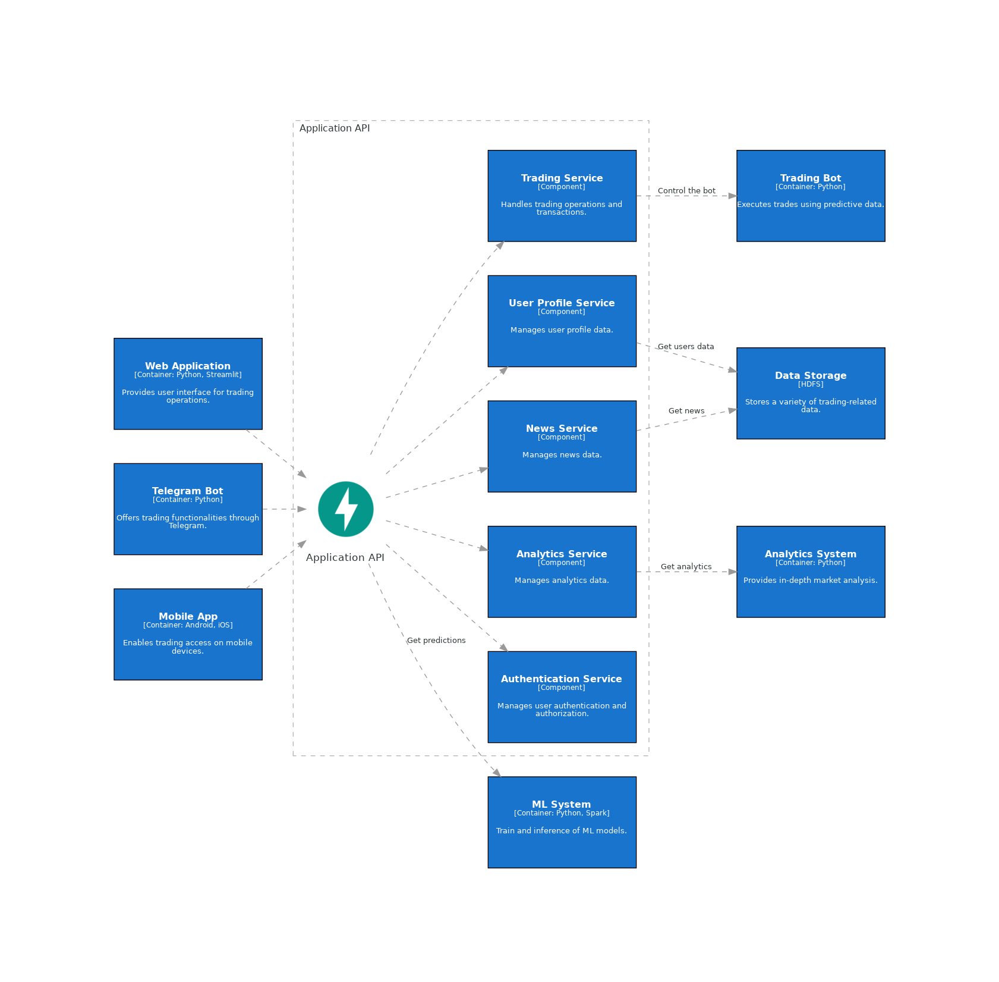
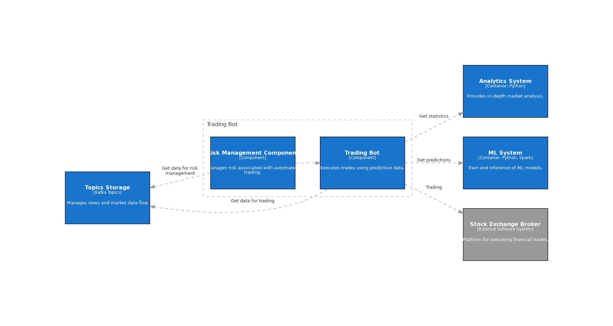

# Trading Bot

## Задачи проекта:
- **Автоматический трейдинг**: Автоматическая торговля с использованием ML моделей для оптимизации процесса принятия решений на основе реального времени.
- **Обработка данных**: Обработка и анализ биржевых данных с использованием ML моделей для предоставления точных прогнозов и рекомендаций.
- **Анализ прибыльности**: Генерация аналитических отчетов для пользователя, позволяющих оценить эффективность торговых стратегий.
- **Доступ с разных платформ**: Реализация интерфейсов через REST API, Telegram-бота и мобильное приложение для удобства использования системы в любое время и в любом месте.
## Потребности бизнеса, решаемые задачей:
- **Сокращение времени для принятия решений**: Благодаря автоматизации торговли и быстрой обработке данных, пользователи могут быстрее реагировать на изменения рынка.
- **Повышение точности прогнозов**: Использование ML моделей для анализа рыночных данных позволяет увеличить точность предсказаний, что ведет к более прибыльной торговле.
- **Диверсификация портфеля**: Автоматическое распределение инвестиций между различными активами и рынками, уменьшая риски и увеличивая потенциал доходности.
- **Пользовательские аналитические отчеты**: Предоставление персонализированных аналитических данных помогает пользователям принимать более обоснованные инвестиционные решения.
## Польза от использования ML:
- **Прогнозирование рыночных тенденций**: ML модели могут обнаруживать сложные шаблоны и тенденции, недоступные для классического анализа.
- **Оптимизация стратегий**: Постоянное обучение и адаптация ML моделей позволяют оптимизировать торговые стратегии в реальном времени.
- **Риск-менеджмент**: ML может помочь в оценке рисков и предложении стратегий для их снижения.
## Успех выполнения задачи:
- **Автоматизация процессов**: Эффективность и надежность автоматизированных торговых операций.
- **Пользовательское удобство**: Удобство и интуитивность пользовательского интерфейса, доступность сервиса на разных платформах.
- **Финансовая выгода**: Положительная динамика доходности портфелей пользователей.

## Use Cases

## C4

### Context

### Containers

### Application API Components

### ML Components

### Analytics Components

### Trading Components

